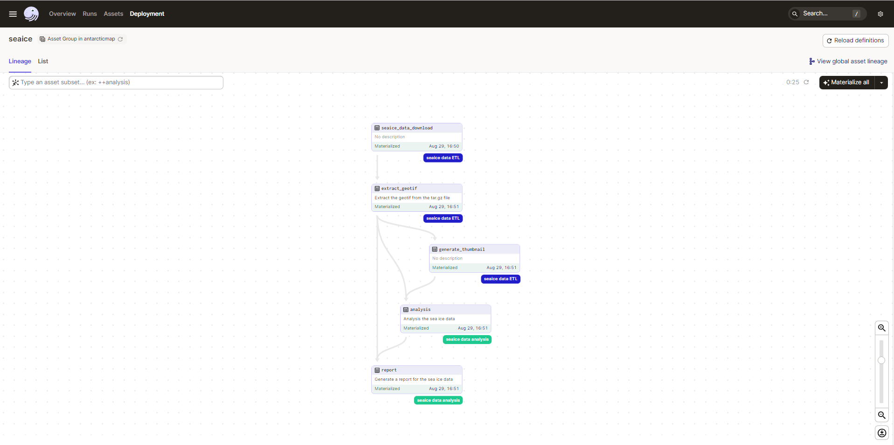
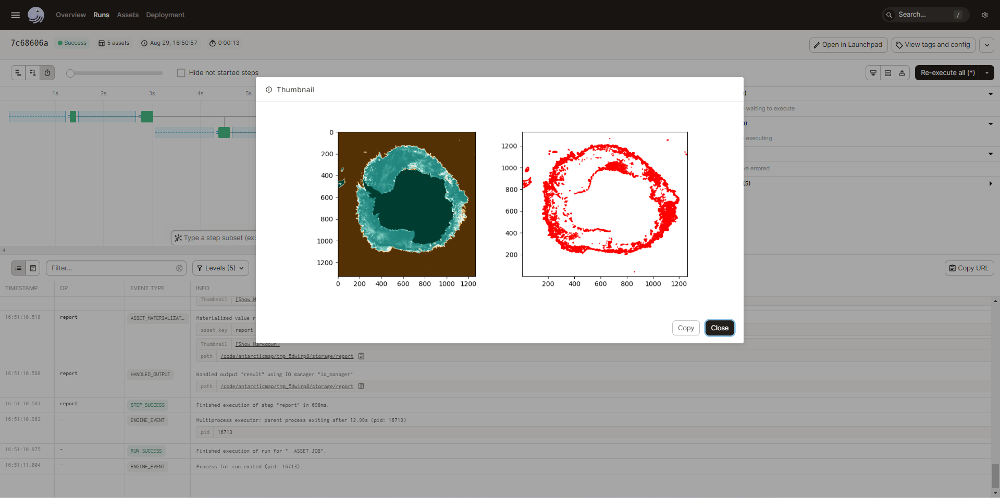

# Dagster example for GIS data

An example of utilizing [Dagster](https://dagster.io/) for processing and analyzing GIS data.

## development

### start the development server

* create `.env.local` file
* run `make up` to start the development containers
* run `make dev` in the created container to start the development server

### Tips:

* installed packages are cached for the next use.
* exit the container, then run `make down` to stop the containers
